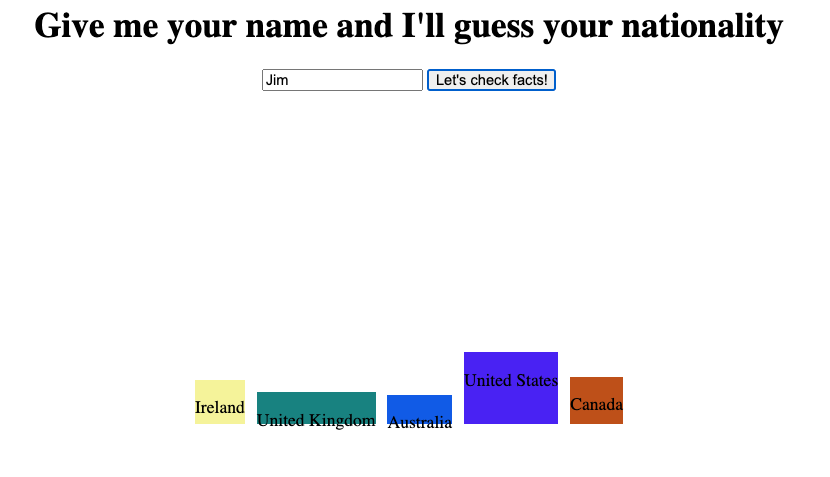
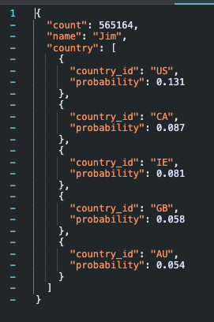
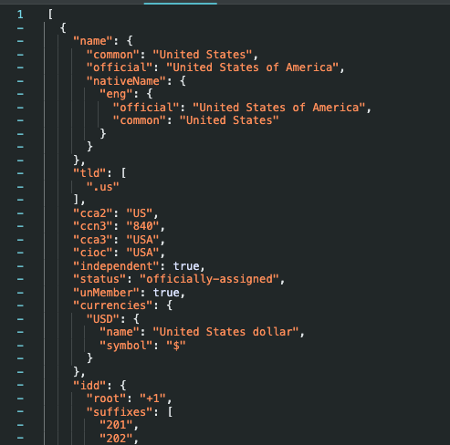

# Rozgrzewka

Celem rozgrzewki jest wykonanie strony, na której uzytkownik po wysłaniu formy ze swoim imieniem
będzie otrzymywał informacje prezentujące prawdopodobieństwo jakiej jest narodowości.

Przykładowe rozwiązanie poniej:



Powyzszy przykład to tylko przykład, tak więc informację zwrotną mozna przedstawić w innej formie (np. procentowej, diagramu kołowego itp).

Do wykonania tego zadania będzie trzeba skorzystać z dwóch API:

```javascript
https://api.nationalize.io/?name=${name}
```

API Nationalize zwraca informację o prawdopodobieństwie pochodzenia uzytkownika wrac z dwuliterowym kodem kraju i prawdopodobieństwem pochodzenia przedstawionym w formie liczby zmiennoprzecinkowej, eg:



```javascript
https://restcountries.com/v3.1/alpha/${code}
```

API restcountries pozwoli nam na przetłumaczenie tego dwuliterowego kodu na pełną nazwę kraju, eg.



## Główne cele zadania:

-  stworzyć formularz o jednym polu input i przycisku do wysyłania formy,
-  strona powinna zawierać nagłówek opisujący cel istnienia strony (jak na przykładzie),
-  napisać event listener, który będzie nasłuchiwał na zdarzenie wysyłania formy,
-  napisać funkcję wykonującą zapytanie do `api nationalize`,
-  napisać funkcję, która pozwoli odpytać `restcountries` celem konwersji dwuliterowego kodu kraju na pełną jego nazwę,
-  napisać funkcję, która będzie wykonywała mapowanie danych z odpowiedzi uzyskanej z `api nationalize` na markup
