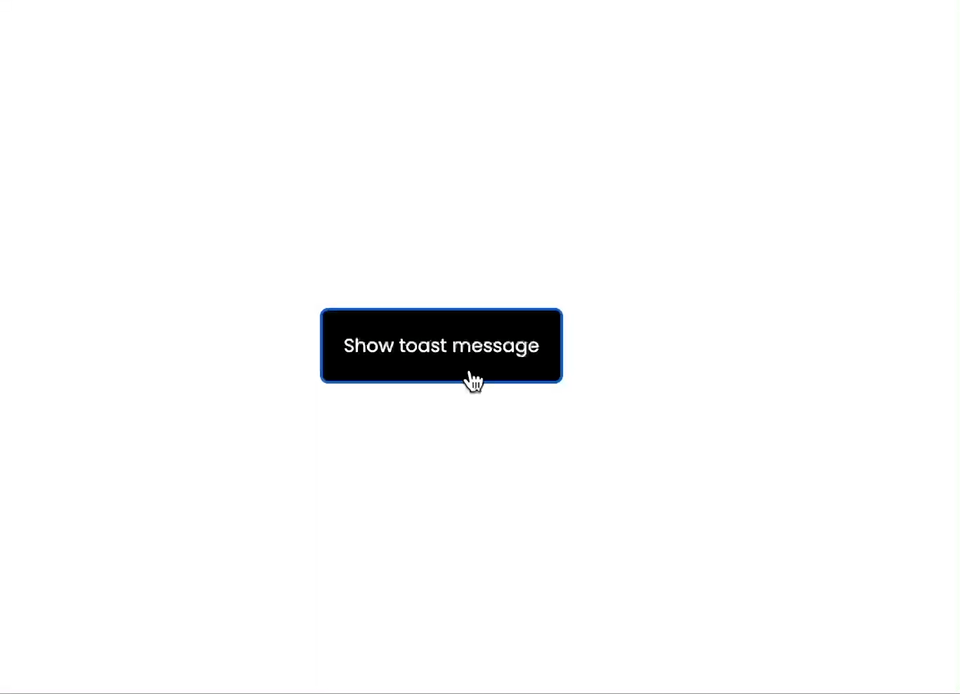

Celem tego ćwiczenia jest odtworzenie następującego efektu:

- Ćwiczenie wykonajcie w grupach zaczynając od rozpisania planu na implementację. Zapiszcie sobie jakie funkcje będą wam potrzebne, jak podepniecie wywołanie funkcji pod przycisk itd.
- Następnie niech każdy w zespole samodzielnie wykona ćwiczenie. Damy sobie na to 30 minut.
- Jeśli komuś z waszej grupy nie uda się wykonać ćwiczenia w zadanym czasie, pomóżcie mu tłumacząc, jak wam udało się je wykonać.

Do osiągnięcia tego celu przydatna będzie [lista zdarzeń](https://www.w3schools.com/jsref/dom_obj_event.asp)
